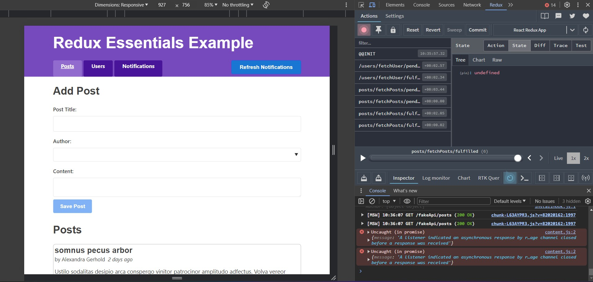

# RTK Query Essentials

This project was built on the initial bootstrapped [setup and code](https://github.com/reduxjs/redux-templates/tree/master/packages/vite-template-redux) from the "Redux Essentials" tutorial in the Redux docs ( https://redux.js.org/tutorials/essentials/part-1-overview-concepts ).

This project is built upon the app found in [Redux Essentials](https://github.com/saadyakubu/redux-essentials). It utilizes the RTK Query of the Redux Library as its data fetching and caching tool.

